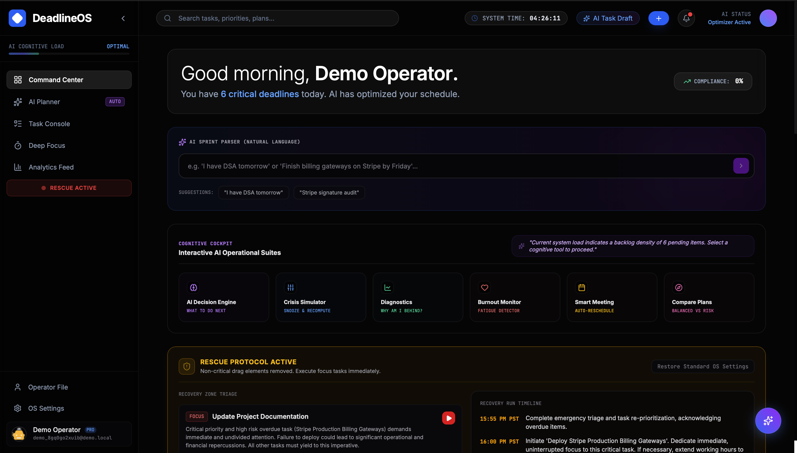
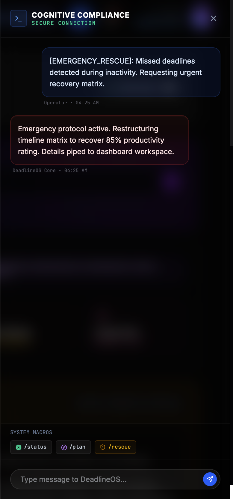
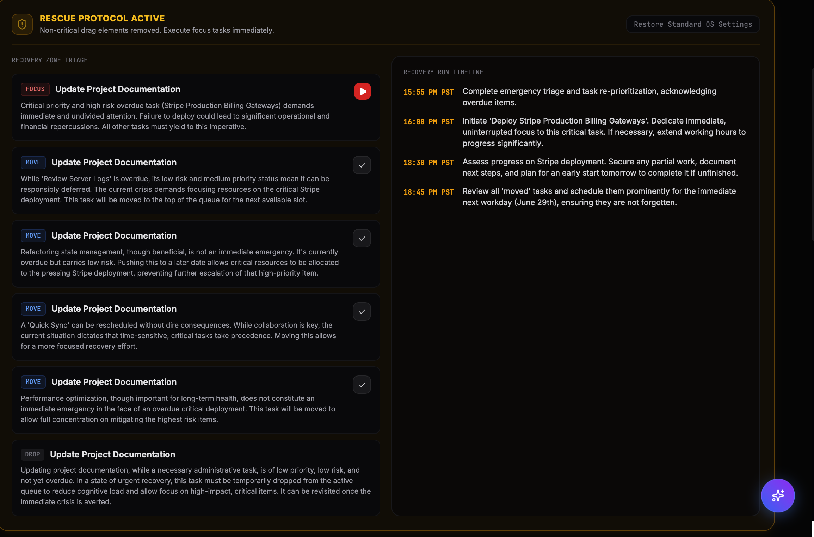
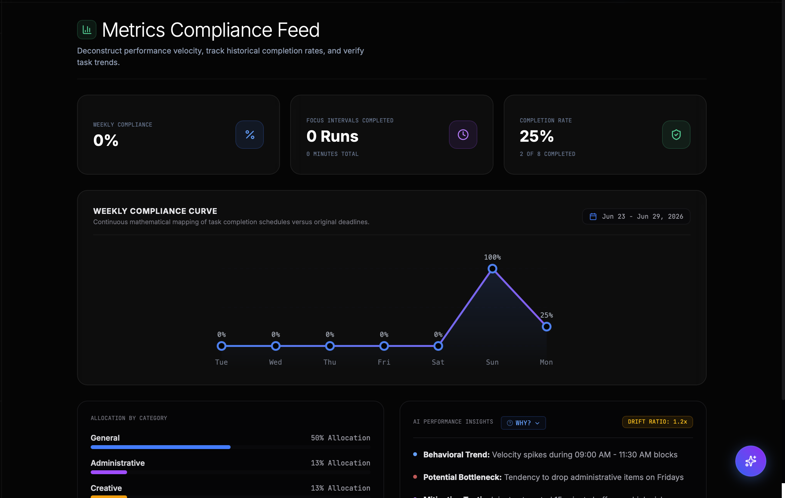
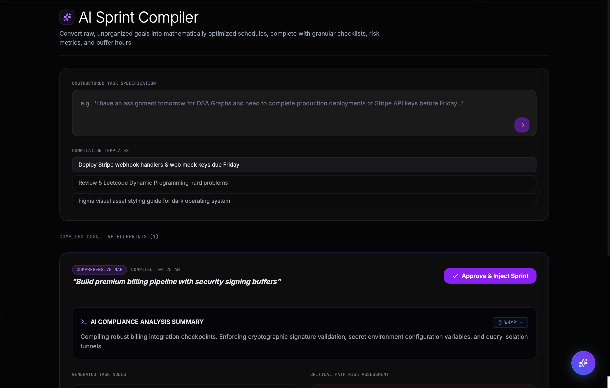

# 🚀 DeadlineOS

<p align="center">

# The AI Execution Operating System

### **Plan. Execute. Recover.**

An intelligent AI-powered productivity platform that doesn't just organize work—it helps users execute it, recover from missed deadlines, and continuously optimize productivity using Google Gemini AI.

</p>

---

<p align="center">


</p>

---

# 📖 Overview

DeadlineOS is a next-generation AI productivity platform built to solve one of the biggest problems students and professionals face—**execution**.

Most productivity applications stop after helping users create tasks.

DeadlineOS goes several steps further.

It continuously understands the user's workload, predicts risks, reorganizes schedules, monitors productivity, and automatically creates intelligent recovery plans whenever deadlines are missed.

Instead of being another task manager, DeadlineOS behaves like an **AI Execution Operating System**.

---

# ❗ Problem Statement

Traditional productivity applications help users create to-do lists, reminders, and calendars.

However, they fail when real life happens.

Users often experience:

- Missed deadlines
- Task overload
- Burnout
- Poor prioritization
- Inefficient planning
- Lack of intelligent recovery

Once a schedule breaks, existing applications rarely help users recover.

---

# 💡 Our Solution

DeadlineOS combines Artificial Intelligence, Cloud Computing, and Real-Time Synchronization to create an adaptive productivity operating system.

Instead of asking users what they should do next, DeadlineOS actively understands their workload and provides intelligent guidance throughout the entire execution journey.

From planning to recovery, every interaction is powered by AI.

---

# ✨ Core Features

## 🧠 AI Execution Engine

- AI-powered task planning
- Intelligent execution strategy generation
- Natural language task understanding
- Personalized productivity recommendations

---

## 🚨 Rescue Mode

The signature feature of DeadlineOS.

Whenever deadlines are missed, DeadlineOS automatically:

- Detects overdue work
- Analyses workload
- Generates realistic recovery plans
- Reorganizes priorities
- Helps users regain momentum

Instead of punishing users for falling behind, DeadlineOS helps them recover.

---

## 🤖 Gemini AI Assistant

Powered by Google Gemini.

Capabilities include:

- Context-aware conversations
- Personalized recommendations
- AI Memory
- Productivity coaching
- Smart execution guidance
- Explainable AI reasoning

---

## 📊 Productivity Analytics

Gain deep insights into your work through:

- Productivity Score
- Completion Trends
- Focus Sessions
- Burnout Detection
- Performance Analytics
- Smart Reports

---

## ☁ Cloud Synchronization

Built on Firebase and Google Cloud.

Features include:

- Firebase Authentication
- Firestore Database
- Real-time Synchronization
- Offline Sync
- Secure Cloud Storage
- Multi-device Support

---

# 🖼️ Application Preview

> **Replace these placeholders with screenshots before submission.**

### Dashboard



### AI Assistant



### Rescue Mode



### Analytics



### Planner



---

# 🏗️ Technology Stack

| Category | Technologies |
|----------|--------------|
| Frontend | React, TypeScript, Tailwind CSS |
| Backend | Node.js, Express.js |
| AI | Google Gemini API, Google AI Studio |
| Authentication | Firebase Authentication |
| Database | Cloud Firestore |
| Cloud | Google Cloud Platform |
| Scheduling | Cloud Scheduler |
| Hosting | Firebase / Google Cloud |

---

# 🛡️ System Architecture

DeadlineOS is designed using a modern cloud-native architecture that combines AI, Firebase, and Google Cloud services to provide a seamless productivity experience.

### Core Architecture

```
                   User
                     │
                     ▼
            React + TypeScript UI
                     │
                     ▼
             Express.js Backend API
                     │
      ┌──────────────┼──────────────┐
      ▼              ▼              ▼
 Google Gemini    Firebase      Firestore
      AI        Authentication    Database
      │              │              │
      └──────────────┼──────────────┘
                     ▼
              Google Cloud Services
```

---

# ⚙️ Key Architecture Highlights

- 🔒 Firebase Authentication with UID-based account isolation
- ☁️ Firestore real-time synchronization
- 🤖 Google Gemini AI integration
- 🧠 Persistent AI Memory
- ⚡ Intelligent AI Context Engine
- 🔄 Offline-first synchronization queue
- 📊 Real-time dashboard updates
- 🚨 Automated Rescue Mode generation
- 🔐 Firestore Security Rules
- 📦 Batch writes & transaction-based updates
- ☁️ Cloud Scheduler powered background automation
- 🛡️ Production-grade error handling

---

# 📂 Project Structure

```
DeadlineOS/
│
├── src/
│   ├── ai/
│   ├── backend/
│   ├── components/
│   ├── context/
│   ├── hooks/
│   ├── pages/
│   ├── services/
│   ├── utils/
│   └── styles/
│
├── public/
│
├── server.ts
│
├── package.json
│
└── README.md
```

---

# 🚀 Getting Started

## Clone the Repository

```bash
git clone https://github.com/YOUR-USERNAME/DeadlineOS.git

cd DeadlineOS
```

---

## Install Dependencies

```bash
npm install
```

---

# 🔑 Environment Variables

Create a file named `.env.local` inside the project root.

Add the following variables:

```env
GEMINI_API_KEY=YOUR_GEMINI_API_KEY

# Firebase Configuration

FIREBASE_API_KEY=

FIREBASE_AUTH_DOMAIN=

FIREBASE_PROJECT_ID=

FIREBASE_STORAGE_BUCKET=

FIREBASE_MESSAGING_SENDER_ID=

FIREBASE_APP_ID=
```

Replace the placeholder values with your own Firebase project configuration and Gemini API key.

---

# ▶️ Run the Application

```bash
npm run dev
```

The development server will start automatically.

Open the URL displayed in your terminal (typically `http://localhost:5173`) in your browser.

---

# 🌐 Deployment

DeadlineOS is designed to be deployed using:

- Firebase Hosting
- Google Cloud Run
- Google Cloud Scheduler
- Firestore Database
- Firebase Authentication

The architecture is cloud-native and supports scalable deployment using Google Cloud infrastructure.

---

# 🚀 Why DeadlineOS?

Unlike traditional productivity applications, DeadlineOS is designed around **execution instead of task management**.

### Traditional Apps

- Create tasks
- Set reminders
- Display calendars

### DeadlineOS

- Understands workload
- Learns user behaviour
- Predicts productivity risks
- Generates AI execution strategies
- Activates Rescue Mode
- Helps users recover from missed deadlines
- Continuously adapts to changing priorities

DeadlineOS doesn't simply organize work.

**It helps users finish it.**

---

# 🎯 Future Roadmap

- 📅 Google Calendar Integration
- 🎤 Voice AI Assistant
- 👥 Team Collaboration
- 📱 Native Android & iOS Apps
- ⌚ Smartwatch Support
- 📧 Smart Email Summaries
- 🤝 Workspace Collaboration
- 🧠 Predictive Scheduling Engine
- 📈 Advanced AI Productivity Forecasting

---

# 🤝 Contributing

Contributions, ideas, and feedback are always welcome.

Feel free to fork the repository, create a feature branch, and submit a pull request.

---

# 📜 License

This project was developed as a hackathon submission for educational and research purposes.

---

# 💙 Acknowledgements

Special thanks to:

- Google AI Studio
- Google Gemini API
- Firebase
- Google Cloud Platform
- React Community
- Tailwind CSS
- TypeScript

---

# ⭐ Support

If you found this project interesting, consider giving it a ⭐ on GitHub.

It helps others discover the project and motivates future development.

---

<p align="center">

## 🚀 DeadlineOS

### **The AI Execution Operating System**

### **Plan. Execute. Recover.**

Built with ❤️ using Google AI Studio, Gemini AI, Firebase and Google Cloud.

</p>
